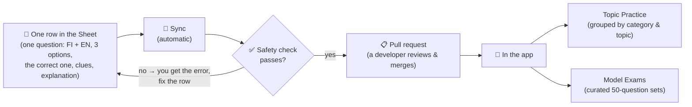
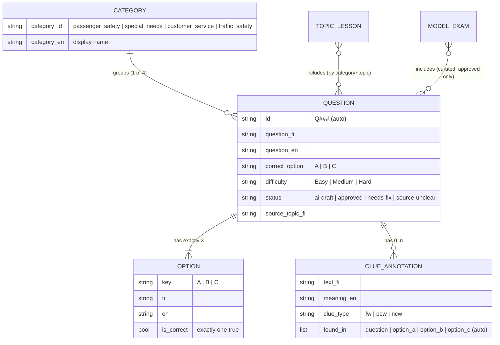

# Content Editor's Guide — The Question Spreadsheet

**Who this is for:** the content editor/reviewer who adds and edits taxi-exam questions, **without needing to be a developer**.
**What it is:** the column-by-column contract for the editing spreadsheet (Google Sheet), what each field means, and **where your content ends up in the app**.
**Related:** `docs/plans/content-pipeline-plan.md` (why we work this way). The columns below match the builder's existing contract (`WORKBOOK_LABEL_TO_KEY` in `content/build_appready.py`), so nothing about the schema changes — only *where* it lives.

---

## 1. The big picture — where your content goes

You edit **one row per question** in the spreadsheet. When you're done, a sync turns your rows into the app's data, after an automatic safety check.



**Two things to remember:**
- A new question first becomes **`ai-draft`**. It shows in Topic Practice for its category once merged, but it does **not** enter a Model Exam until it is reviewed and marked **`approved`**.
- You never edit code or the app. You only edit the spreadsheet. If a row is wrong (e.g. no correct answer marked), the safety check **rejects it and tells you why** — nothing broken reaches users.

---

## 2. The columns (the template)

Fill these in, one row per question. **Required** columns must not be empty.

| Column | Required | Allowed values / format | Where it goes (JSON) |
|---|---|---|---|
| **Question ID** | leave blank for new | e.g. `Q328` (the system assigns new ones) | `id` |
| **Category** | ✅ | one of the **4 categories** (see §6) | `category_id` (+ `category_en` auto-filled) |
| **Topic** | recommended | short FI topic label, e.g. `Turvavyö / lapsi` | `source_topic_fi` — groups the question into a Topic Practice lesson |
| **Ref #** | optional | source reference, e.g. `M10` | `ref_no` |
| **Question (FI)** | ✅ | the question in Finnish | `question.fi` |
| **Question (EN)** | ✅ | the English translation | `question.en` |
| **Option A (FI)** | ✅ | answer A in Finnish | `options[0].fi` |
| **Option A (EN)** | ✅ | answer A in English | `options[0].en` |
| **Option B (FI)** | ✅ | answer B in Finnish | `options[1].fi` |
| **Option B (EN)** | ✅ | answer B in English | `options[1].en` |
| **Option C (FI)** | ✅ | answer C in Finnish | `options[2].fi` |
| **Option C (EN)** | ✅ | answer C in English | `options[2].en` |
| **Correct (A/B/C)** | ✅ | exactly one of `A`, `B`, `C` | sets `is_correct` + `correct_option` |
| **Focus words (FI)** | optional | `;`-separated FI phrases | `clue_annotations` type `fw` |
| **Focus words (EN)** | optional | `;`-separated EN meanings (same order) | meanings for `fw` |
| **Positive clues (FI)** | optional | `;`-separated FI phrases that point to the **correct** answer | `clue_annotations` type `pcw` |
| **Positive clues (EN)** | optional | `;`-separated EN meanings | meanings for `pcw` |
| **Negative clues (FI)** | optional | `;`-separated FI phrases that point to a **wrong** answer | `clue_annotations` type `ncw` |
| **Negative clues (EN)** | optional | `;`-separated EN meanings | meanings for `ncw` |
| **Explanation (EN)** | recommended | why the correct answer is right (English) | `explanation_en` |
| **Difficulty** | optional | `Easy` · `Medium` · `Hard` | `difficulty` |
| **Tags** | optional | `;`-separated keywords, e.g. `seatbelt;child` | `tags` |
| **Status** | ✅ | `ai-draft` · `approved` · `needs-fix` · `source-unclear` | `status` (gates into surfaces) |
| **Reviewer notes** | optional | free text — flags, doubts, sources | `reviewer_notes` |

> **Tip:** in Google Sheets, set the **Category**, **Correct**, **Difficulty**, and **Status** columns as drop-downs (Data → Data validation) so they can't be mistyped — the safety check rejects anything outside the allowed values anyway.

---

## 3. Field rules (what the safety check enforces)

- **Exactly one** of `Correct` per row, and it must be `A`, `B`, or `C`. (No blanks, no two correct.)
- **Both FI and EN** must be filled for the question and **all three** options.
- **Category** must be one of the four official categories — see §6.
- **Clue meanings line up by position**: the 2nd phrase in *Positive clues (FI)* pairs with the 2nd in *Positive clues (EN)*. Keep the counts equal.
- **`source-unclear`** is the "park it" status: a question marked this way is **excluded from the app entirely** (use it when the source answer is genuinely unknown — don't guess a correct answer).
- A question used in a **Model Exam** must be **`approved`** (not `ai-draft`).

---

## 4. Worked example — one row becomes one question

**What you type in the row:**

| Column | Value |
|---|---|
| Category | `Passenger Help & Safety` |
| Topic | `Turvavyö / lapsi / turvalaite` |
| Question (FI) | `Kuinka sinun tulee toimia, jos ilman aikuista matkustava alle 15-vuotias lapsi irrottaa turvavyönsä…?` |
| Question (EN) | `How should you act if a child under 15 travelling without an adult removes their seat belt…?` |
| Option A (FI) | `Pysäytät ajoneuvon ja keskustelet asiasta. Jatkat matkaa vasta, kun turvavyö on kiinni.` |
| Option A (EN) | `You stop the vehicle and discuss it. You continue only when the seat belt is fastened.` |
| Option B (FI) | `Pysäytät ja varoitat, että poistat hänet autosta, ellei hän kiinnitä turvavyötä.` |
| Option B (EN) | `You stop and warn that you will remove them from the car unless they fasten it.` |
| Option C (FI) | `Annat lapsen matkustaa ilman turvavyötä ja ilmoitat huoltajalle.` |
| Option C (EN) | `You let the child travel without a belt and inform the guardian.` |
| Correct (A/B/C) | `A` |
| Positive clues (FI) | `Pysäytät ajoneuvon; keskustelet; turvavyö on kiinni` |
| Positive clues (EN) | `stop the vehicle; discuss; seat belt is fastened` |
| Negative clues (FI) | `poistat hänet autosta; ilman turvavyötä` |
| Negative clues (EN) | `remove them from the car; without a seat belt` |
| Explanation (EN) | `The driver must ensure an under-15 uses the belt: stop, discuss, continue only once fastened.` |
| Difficulty | `Medium` |
| Tags | `seatbelt; child; under 15; driver responsibility` |
| Status | `approved` |

**What the sync produces (`src/data/json/questions.json`):**

```jsonc
{
  "id": "Q001",                       // assigned/kept by the system
  "category_id": "passenger_safety",  // from Category
  "category_en": "Passenger Help & Safety",  // auto-filled from Category
  "source_topic_fi": "Turvavyö / lapsi / turvalaite",
  "question": { "fi": "Kuinka sinun…", "en": "How should you…" },
  "options": [
    { "key": "A", "fi": "Pysäytät…", "en": "You stop…", "is_correct": true },
    { "key": "B", "fi": "Pysäytät ja varoitat…", "en": "You stop and warn…", "is_correct": false },
    { "key": "C", "fi": "Annat lapsen…", "en": "You let the child…", "is_correct": false }
  ],
  "correct_option": "A",
  "clue_annotations": [               // built from your clue columns; "found_in" auto-detected
    { "text_fi": "Pysäytät ajoneuvon", "meaning_en": "stop the vehicle", "clue_type": "pcw", "found_in": ["option_a"] },
    { "text_fi": "poistat hänet autosta", "meaning_en": "remove them from the car", "clue_type": "ncw", "found_in": ["option_b"] }
  ],
  "explanation_en": "The driver must ensure an under-15 uses the belt…",
  "difficulty": "Medium",
  "tags": ["seatbelt", "child", "under 15", "driver responsibility"],
  "status": "approved"
}
```

You only fill the friendly columns — everything in *italic comments* above is filled in **automatically**.

---

## 5. The data model — how a question relates to everything



- **A question belongs to exactly one Category** and **has exactly three Options**, one correct.
- **Topic Practice lessons** are built **automatically** by grouping questions by **Category + Topic** — so giving a good `Topic` is how your question lands in the right lesson.
- **Model Exams** are **hand-curated** 50-question sets (15/15/10/10 across the four categories) and only ever use **`approved`** questions.

---

## 6. The 4 categories (the taxonomy)

Every question belongs to exactly one. These map to the official Traficom exam areas and to the Model Exam weighting:

| Category (pick this) | `category_id` | Questions per 50-question Model Exam |
|---|---|---|
| **Passenger Help & Safety** | `passenger_safety` | 15 |
| **Special Passenger Needs** | `special_needs` | 15 |
| **Customer Service** | `customer_service` | 10 |
| **Transport & Traffic Safety** | `traffic_safety` | 10 |

> The category you choose also sets how much a question is "needed" — Model Exams pull 15/15/10/10 from these. Adding questions to any category is always safe; it just grows the pool.

---

## 7. Clue words explained (the app's study method)

The app teaches a "spot the clue word" method. Your three clue columns feed it:

- **Focus words (`fw`)** — key phrases in the **question** that frame what's being asked (e.g. *alle 15-vuotias* = under 15).
- **Positive clues (`pcw`)** — phrases that point toward the **correct** answer (e.g. *varmistaa* = make sure).
- **Negative clues (`ncw`)** — phrases that point toward a **wrong** answer (e.g. *ilman turvavyötä* = without a seat belt; absolutes like *aina/koskaan* = always/never).

You list the FI phrase and its EN meaning (semicolon-separated, same order). The system figures out **where** each phrase appears (question or which option) automatically — you don't fill that in.

---

## 8. What's automatic — you don't fill these

| Auto-filled | How |
|---|---|
| `id` for a new question | assigned in sequence |
| `category_en` | from your **Category** choice |
| `clue_annotations.found_in` | by finding your clue phrase inside the question/options |
| `fi_raw` | a copy of the FI text (internal) |
| `is_correct` flags | from your **Correct (A/B/C)** choice |
| Topic Practice lesson membership | by grouping on Category + Topic |

---

## 9. New-question checklist

1. Leave **Question ID** blank.
2. Pick a **Category** (one of the four) and write a clear **Topic**.
3. Write **Question (FI)** and **Question (EN)**.
4. Write all three options in **FI and EN**.
5. Mark exactly one **Correct (A/B/C)**.
6. *(Recommended)* add **Positive/Negative/Focus clues** (FI + EN, same order) and an **Explanation (EN)**.
7. Set **Difficulty** and **Tags**.
8. Set **Status** = `ai-draft` (or `approved` if you're the reviewer and it's confirmed).
9. Save. The sync runs, the safety check validates, and a pull request is opened for a developer to merge.

> If the safety check rejects your row, it names the row and the problem (e.g. *"Q328 has 0 correct options"* or *"category 'Customer Care' is not one of the four"*). Fix the cell and it re-runs.
