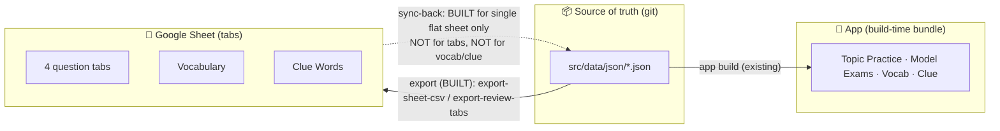

# Content Pipeline — Status & Two-Way-Sync Handoff (for the backend developer)

**Status:** One-way pipeline built (app data → reviewable Google Sheet) + a validation gate. The **two-way sync** (editor's Sheet edits → app) is **intentionally not built** — it needs a design decision that belongs to the backend developer. This doc is the handoff.

**Branch:** `feat/content-ci-gate` (not yet merged). **Related:** `docs/plans/content-pipeline-plan.md` (the why), `docs/content/spreadsheet-template.md` (the question column contract).

---

## 1. TL;DR

- Content's single source of truth is the git-tracked JSON in `src/data/json/` — **not** the old Excel workbook (retired) and **not** the Google Sheet.
- We built a **one-way, read-only** export: JSON → a structured Google Sheet, organised into tabs so a non-developer editor can review each module separately.
- We built a **validation gate** (`npm run check:data`) that blocks broken content (bad schema, contradictory answers, i18n drift) from ever reaching the app — wired into CI on every PR.
- We built (but only for the original *single-sheet* layout) a **sync-back** script + GitHub Action that turns Sheet edits into a pull request.
- **What's missing:** the sync-back does **not** yet understand the new **tabbed** layout, and there is **no sync lane at all for vocabulary or clue words**. Closing that — the true "two-way" sync — is the ask below.

**Today, editing the Google Sheet does NOT change the app.** The Sheet is a review copy.

---

## 2. What's built (on `feat/content-ci-gate`)

| Area | File(s) | What it does |
|---|---|---|
| **Validation gate (P0)** | `scripts/check-data-integrity.mjs`, `scripts/content-twins-baseline.json` | Per-question schema, no-new-contradictory-twins (ratcheted baseline of 19 known), model-test integrity, exam-fact constants, en/fi i18n parity. `npm run check:data`. |
| **Shared contract** | `scripts/content-sheet.mjs` | One column contract (24 cols) + dependency-free CSV + question↔row field derivations (category label↔id, clue `found_in`, provenance preservation). Used by every direction. |
| **Seed export (P1)** | `scripts/export-sheet-csv.mjs` → `content/sheet/questions-seed.csv` | All 327 questions as one CSV (the original single-sheet import). |
| **Per-tab review export** | `scripts/export-review-tabs.mjs` → `content/sheet/tabs/*.csv` | 4 question tabs by category (Category column dropped — the tab *is* the category) + a Vocabulary tab (84 words) + a Clue Words tab (55). |
| **Sync-back (P2, single-sheet only)** | `scripts/sync-sheet.mjs` | CSV (`--file`/`--url`) → merges editable columns onto `questions.json`, preserves provenance, assigns `Q###` to new rows. `--dry-run` supported. |
| **Round-trip guard** | `scripts/verify-sheet-roundtrip.mjs` | Asserts export→sync is byte-lossless; runs in CI. |
| **CI** | `.github/workflows/ci.yml` | `tsc --noEmit` + the gate + the round-trip guard, on every PR. |
| **Sheet→PR automation (single-sheet only)** | `.github/workflows/content-sync.yml` | `workflow_dispatch(csv_url)`: fetch CSV → sync → gate → open PR. |

**Verified:** export→sync is byte-for-byte lossless across all 327 questions; a simulated edit (status change + a new blank-id row) produced a correct `Q328`; the gate is green; `tsc` clean. The single-sheet Google import was checked cell-for-cell (rows it was possible to read: 0 mismatches).

---

## 3. The Google Sheet (review workbook)

Imported into the owner's Google Drive. Tabs:

| Tab | Source | Rows | Columns |
|---|---|---|---|
| `01 Q - Passenger Help & Safety` | `questions.json` (category `passenger_safety`) | 91 | 23 (the question contract **minus** Category) |
| `02 Q - Special Passenger Needs` | `special_needs` | 57 | 23 |
| `03 Q - Customer Service` | `customer_service` | 91 | 23 |
| `04 Q - Transport & Traffic Safety` | `traffic_safety` | 88 | 23 |
| `05 Vocabulary` | `vocab.json` → `words` | 84 | Word ID, Set, Word (FI), Meaning (EN), Word forms (FI/EN), Exam use (EN) |
| `06 Clue Words` | `clue.json` → `words` | 55 | Clue ID, Group, Phrase (FI), Meaning (EN), Effect (EN), Exception (EN) |

Excluded by decision: the model-test pool (`model_test_questions.json`, 80) and the auto-generated vocab/clue quizzes.

> Note: from the tooling side, reading the *live* Sheet back was unreliable (Drive search/read couldn't resolve the shared link). Verification leaned on the fact that CSV import is deterministic + the source was verified. The backend dev may want to confirm the live workbook id and access path (see §6).

---

## 4. Architecture — current vs. requested

The dotted arrow is the gap.

---

## 5. Decisions already locked in this effort

- **JSON-in-git is the single source of truth.** The Sheet is a disposable, regenerable authoring/review surface; the `.xlsx` is retired.
- **Pipeline is Node, not Python.** The old Python build env was uninstalled and was a root cause of content drift; everything now runs in CI with zero setup.
- **No approval "bouncer" for now.** We did *not* gate surfaces to `approved`-only — nothing is approved yet (313/327 are `ai-draft`), so enforcing it would empty Topic Practice and break Model Exams. The status field exists; enforcement is deferred (revisit after expert review).
- **Review-first.** The per-tab workbook is for the editor to read/fix; the sync-back was deliberately deferred to here.
- **Content stays bundled-static** (D-E in the plan) — *but this is the decision most worth the backend dev revisiting* (see §6).

---

## 6. The ask — backend developer, please review/own the two-way sync

The remaining work is a **bidirectional sync**, and the right shape depends on calls that are yours to make:

1. **Bundled-static vs backend-served content.** Today content is bundled into the app build; Sheet edits would reach users via a normal release (Sheet → PR → merge → build). Given the Convex/NestJS backend (`backend/convex/`), do we instead want content served/cached by the backend so edits publish without an app release? This reopens decision **D-E**. Recommendation unchanged unless instant-publish is a hard requirement, but it's your call.

2. **Tabbed sync for questions.** Extend `sync-sheet.mjs` to read the 4 category tabs (each published as its own CSV) and recombine into `questions.json`, deriving `category_id` from the tab. The single-sheet path already works and is the reference.

3. **New sync lanes for vocab & clue.** These are **relational** (`vocab.json` = sets + words + quizzes; nested `forms_fi`), unlike the flat question schema. They are currently **export-only**. A round-tripping design is needed (or a decision that these stay read-only).

4. **Sheet access/auth.** Pick: publish-to-CSV (no auth, simplest, current `content-sync.yml` assumption) vs Sheets API + service account (private, needs a secret). If multi-tab, publish-to-CSV means one published URL per tab.

5. **Ownership & cadence.** Who runs the sync (the `workflow_dispatch` Action, on demand) and reviews/merges the resulting PRs day-to-day.

**Suggested entry points:** `scripts/sync-sheet.mjs` (reference implementation), `scripts/content-sheet.mjs` (the mapping layer to extend), `.github/workflows/content-sync.yml` (the automation to generalise), and `docs/plans/content-pipeline-plan.md` §5–§7 (validation gate + phased plan + risks).

---

## 7. Open questions

- Live Google Sheet workbook id + sharing/access for CI (see §3 note).
- Should the model-test pool and vocab/clue quizzes ever become editor-editable, or stay engineering-curated?
- Re-drift guard: do we want a CI check that warns when `src/data/json/*.json` is edited outside the sync bot?
