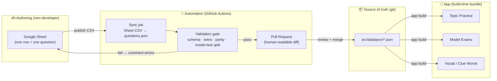

# Content Pipeline Plan — Drop Excel-as-source, adopt a Sheet → validated-PR workflow

**Status:** P0–P2 (one-way) built on `feat/content-ci-gate`; two-way sync handed to backend
**Date:** 2026-06-29
**Owner:** (assign)
**Related:** `docs/content/two-way-sync-handoff.md` (current state + the backend ask — **read this first**), `docs/content/spreadsheet-template.md` (the editor's column contract + data-model diagrams), `docs/audit/content-fact-check.md` (what drift cost us)

> **Progress note (2026-06-29):** P0 (gate), P1 (seed export) and P2 (one-way Sheet→PR sync, single-sheet) are built in Node and verified; a per-tab review workbook (4 question tabs + Vocabulary + Clue Words) was added. P3's approval gate was **dropped for now** (nothing is `approved` yet; enforcing it would empty the surfaces). The **two-way / tabbed / vocab+clue sync is deferred to the backend developer** — see the handoff doc.

---

## 1. Problem

The app's content (questions, vocab, clue words, model tests) was originally authored in an **Excel workbook** (`content/content_workbook.xlsx`) that `content/build_appready.py` compiled into the shipped JSON (`src/data/json/*.json`). Over time the team **drifted**: changes were made directly in the JSON and the UI, the Python build environment is no longer installed, and the workbook is now a **stale ancestor**, not the source of truth.

This isn't just untidy — it **caused real, user-facing bugs** (see `docs/audit/content-fact-check.md`): contradictory answer keys across near-identical questions (Q051/Q053/Q090/Q314/Q057) and a corrupted wheelchair option that taught a dangerous wrong answer (Q029/Q053). These are textbook **two-sources-of-truth** symptoms.

## 2. Goal

A workflow where a **non-developer content editor** can add and edit questions safely, where there is **one source of truth**, every change is **reviewable and reversible**, and **CI mechanically prevents** broken content from shipping.

## 3. Locked decisions

- **D-A — Git-tracked JSON is the single source of truth.** `src/data/json/questions.json` (and siblings) is canonical. The binary `.xlsx` is retired as a source (kept only as archived provenance). *Rationale: a binary that can't be diffed, merged, reviewed in a PR, or validated by CI must not be the source of truth in a git product.*
- **D-B — The editor authors in Google Sheets; the Sheet is a one-way authoring lane, not the truth.** A sync turns the Sheet into a validated pull request. *Rationale: lowest learning curve given the team's spreadsheet history, while keeping JSON+git as the truth.*
- **D-C — A CI validation gate is mandatory and is the prerequisite for everything else.** No content reaches `master` (or the app) without passing it. *Rationale: it's the safety net that lets a non-dev contribute without being able to break the app or the exam logic. It would have auto-caught every bug in the audit.*
- **D-D — `review_status` gates content into user surfaces.** New/changed questions default to `ai-draft`; only `approved` content flows into Topic Practice and Model Tests. *Rationale: 313/327 questions are still AI-draft pending Finnish expert sign-off; the editor's core job becomes approve / flag.*
- **D-E — Content stays bundled-static (no runtime CMS / backend-served content).** The app keeps bundling JSON; editor changes reach users on the next build/release. *Rationale: exam content is slow-changing and used offline; a runtime CMS would force caching/offline/sync complexity and a new dependency for no real benefit. Revisit only if instant-publish-without-release becomes a hard requirement.*
- **D-F — The Sheet reuses the existing column contract.** The columns already defined in `build_appready.py` (`WORKBOOK_LABEL_TO_KEY`) become the Sheet's columns, so the schema is unchanged and familiar. See `docs/content/spreadsheet-template.md`.

## 4. Target architecture

Key property: the **only** way content changes is Sheet → Sync → **Validate** → PR → merge. There is no second lane. Direct JSON edits are still possible for developers but go through the same PR + validation gate.

## 5. The CI validation gate (the linchpin)

A single check (extends the existing `scripts/check-data-integrity.mjs`, wired into a GitHub Action alongside `tsc --noEmit` and i18n parity) that **fails the PR** on any of:

1. **Per-question schema** — exactly one correct option; FI **and** EN present for question + all options; `category` ∈ the 4-category taxonomy; `Correct` ∈ {A,B,C}; `Difficulty` ∈ {Easy,Medium,Hard}; `Status` ∈ the allowed set.
2. **No contradictory twins** — two questions with near-identical normalized text but different correct answers fail. *(This is the check that would have caught Q029/Q053 vs MTQ-052 automatically.)*
3. **Model-test integrity** — each test = 50 unique resolvable questions, split 15/15/10/10, time 45, pass 76 *(already enforced)*.
4. **Exam-fact constants** — `EXAM_TOTAL/OVERALL_MIN/TIME/PASS` match the regulation *(already enforced)*.
5. **i18n parity** — en/fi locale namespaces have identical key sets.
6. **Approval gate** — only `approved` questions may be referenced by a Model Test.

## 6. Phased rollout

| Phase | Deliverable | Depends on | Owner |
|---|---|---|---|
| **P0** | CI validation gate (script + GitHub Action) — extends `check-data-integrity.mjs` with the twin check, schema check, i18n parity; runs on every PR | — | dev |
| **P1** | Sheet schema + a **seed export** of the current 327 questions into the Sheet (so the editor starts from real data), per `docs/content/spreadsheet-template.md` | P0 | dev + editor |
| **P2** | **Sync job**: a `workflow_dispatch` GitHub Action that fetches the published-CSV, maps columns → `questions.json` (reusing the existing `build_appready.py` field derivations: `found_in`, `fi_raw`, `category_en`, status default), validates, and opens a PR | P0, P1 | dev |
| **P3** | **Review workflow**: `review_status` (`ai-draft`/`approved`/`needs-fix`) wired so only `approved` flows into surfaces; editor guide written | P2 | dev + editor |
| **P4** *(optional)* | Extend the same pattern to vocab / clue words / model-test curation tabs | P2 | dev |

## 7. Risks & mitigations

| Risk | Mitigation |
|---|---|
| **Re-drift** — people keep editing JSON directly and the Sheet goes stale again | Make the Sheet the *only* authoring lane; the seed export + sync make it the easiest path. Optionally a CI check warns if JSON changes land outside the sync bot. |
| **Binary/merge pain** | Eliminated — JSON is the source; the Sheet is disposable/regenerable. |
| **Offline** | Unchanged — content stays bundled; no runtime fetch. |
| **Editor ships a wrong answer** | The validation gate + `ai-draft → approved` review gate; nothing `ai-draft` enters Model Tests. |
| **Sheet ↔ builder schema drift** | Single column contract (`docs/content/spreadsheet-template.md`) referenced by both; a test asserts the Sheet headers match it. |
| **Lost provenance** | Archive `content_workbook.xlsx` + `master.xlsx` under `content/sources/` with a README marking them frozen. |

## 8. Out of scope (explicitly)

- A custom admin panel (rejected — reinvents existing tools).
- A runtime CMS / backend-served content (deferred per D-E).
- Auto-merging the editor's PRs (a human reviews + merges, at least until the gate is trusted).

## 9. Open questions

1. Sheet access mechanism — **publish-to-CSV** (no auth, simplest) vs **Sheets API + service account** (private, needs a secret). Recommend starting with publish-to-CSV.
2. Who reviews/merges the editor's PRs day-to-day?
3. Cadence of the sync — on demand (`workflow_dispatch`) vs scheduled. Recommend on-demand to start.
4. Do we want the same lane for **vocab/clue** now, or questions-only first? Recommend questions-first.
